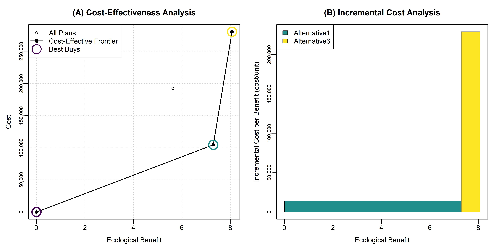
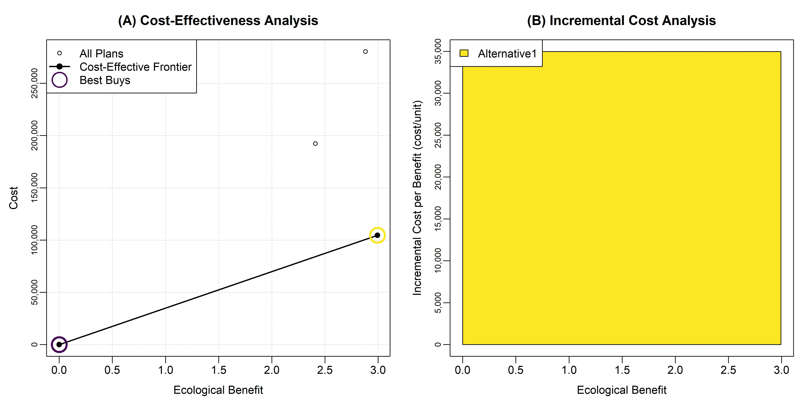

Corresponding Author:  
Kyle McKay, PhD, PE  
Environmental Laboratory, ERDC  
U.S. Army Corps of Engineers  
Phone: 917-790-8717  
Email: kyle.mckay@usace.army.mil


```{r options, include=FALSE}
#Markdown options
knitr::opts_chunk$set(echo=FALSE, warning=FALSE, message = FALSE) 

##########
#Clear local memory
rm(list=ls(all=TRUE))

##########
#Load R package containing CEICA
library(ecorest)

#Load R package containing cost engineering functions
library(EngrEcon)

#Load R package containing color palette
library(viridis)

##########
#IMPORT ALL UTOY DATA

#Import ecological modeling data
eco <- read.csv("Phase 2_Alternatives_Score_05212024_SKM_EcoOutput.csv", header=TRUE, dec=".", na.strings="NA", stringsAsFactors = FALSE)

#Import cost data
cost <- read.csv("Phase 2_Alternatives_Score_05212024_SKM_Cost.csv", header=TRUE, dec=".", na.strings="NA", stringsAsFactors = FALSE)
```


**TEMPORARY ECO DATA. FAKE COST DATA.**


# **1. Introduction**   

Did this work?

What is CEICA? Why is it useful?  

Where did benefits come from? Describe model briefly. Include data in an appendix. Describe the need for annualization. 

```{r}
#Summary info on sites 
sites <- unique(eco$ReachID)
nsites <- length(sites)

#Isolate restoration alternatives for each site
alts <- list()
for(i in 1:nsites){alts[[i]] <- cost$SiteAction[which(cost$ReachID == sites[i])]}

#Count the number of actions at each site
nactions <- c()
for(i in 1:nsites){nactions[i] <- length(alts[[i]])}
nactions.total <- sum(nactions)

##########
#BENEFIT ANNUALIZATION
#Specify temporal assessment points for analysis
time <- c(0,2,10,50)

#Loop over each site and alternative annualizing outcomes
AAHU <- data.frame(matrix(NA, nrow=nactions.total, ncol=7))
colnames(AAHU) <- c("ReachID", "SiteAction", "RipL", "RipR", "Ins", "Total", "Lift")

#Populate with site and alternative names
AAHU$ReachID <- cost$ReachID
AAHU$SiteAction <- cost$SiteAction

for(i in 1:nactions.total){
  #Isolate the correct site and alternative
  site.alt.temp <- which(eco$ReachID == AAHU$ReachID[i] & eco$SiteAction == AAHU$SiteAction[i] & eco$HydroAction == "None")
  
  #Annualize benefits (first removing NAs)
  AAHU$RipL[i] <- annualizer(time, as.numeric(eco$RipL_Hab_HU[site.alt.temp]))
  AAHU$RipR[i] <- annualizer(time, as.numeric(eco$RipR_Hab_HU[site.alt.temp]))
  AAHU$Ins[i] <- annualizer(time, as.numeric(eco$Ins_Hab_HU[site.alt.temp]))
  AAHU$Total[i] <- sum(AAHU$RipL[i], AAHU$RipR[i], AAHU$Ins[i])
}

#Loop over each site calculating lift
for(i in 1:nsites){
  #Isolate the location of all actions for this site
  sites.AAHU.temp <- which(AAHU$ReachID == sites[i])
  
  #Isolate the location of the FWOP for this site
  FWOP.temp <- which(AAHU$ReachID == sites[i] & AAHU$SiteAction == "FWOP")
  
  #Compute lift
  AAHU$Lift[sites.AAHU.temp] <- AAHU$Total[sites.AAHU.temp] - AAHU$Total[FWOP.temp]
}
```


Where did costs come from? Include data in an appendix. Describe the need for annualization. 

```{r}
#COST ANNUALIZATION

#Set federal discont rate for water resources projects in FY24
discount <- 0.0275

##########
#Create a data frame with all PRESENT VALUE costs
cost_present <- data.frame(matrix(NA, nrow=nactions.total, ncol=7))
colnames(cost_present) <- c("ReachID", "SiteAction", "ProjectFirst", "Monitoring", "AdMan", "IDC", "OM")

  #Populate some values from input data
  cost_present$ReachID <- cost$ReachID
  cost_present$SiteAction <- cost$SiteAction
  cost_present$ProjectFirst <- cost$Project_First
  cost_present$Monitoring <- cost$Monitoring
  cost_present$AdMan <- cost$AdMan
  
  #Loop over each alternative to compute IDC
  for (i in 1:nactions.total){
    cost_present$IDC[i] <- ifelse(cost$Duration_mo[i]==0, 0, interest_during_construction(discount, cost$Duration_mo[i], cost$Project_First[i]))
  }
  
  #Compute present value O&M cost
  cost_present$OM <- annual_to_present(discount, 50, cost$OM_Annual)

##########
#Create a data frame with all ANNUALIZED costs
cost_ann <- data.frame(matrix(NA, nrow=nactions.total, ncol=8))
colnames(cost_ann) <- c("ReachID", "SiteAction", "ProjectFirst", "Monitoring", "AdMan", "IDC", "OM", "Total")

  #Populate some values from input data
  cost_ann$ReachID <- cost$ReachID
  cost_ann$SiteAction <- cost$SiteAction
  cost_ann$OM <- cost$OM_Annual
  
  #Annualize project first cost and IDC over 50 year horizon
  cost_ann$ProjectFirst <- present_to_annual(discount, 50, cost$Project_First)
  cost_ann$IDC <- present_to_annual(discount, 50, cost_present$IDC)
  
  #Annualize monitoring and adaptive management over 10 year horizon
  cost_ann$Monitoring <- present_to_annual(discount, 10, cost$Monitoring)
  cost_ann$AdMan <- present_to_annual(discount, 10, cost$AdMan)
  
  #Sum annualized costs
  cost_ann$Total <- cost_ann$ProjectFirst + cost_ann$Monitoring + cost_ann$AdMan + cost_ann$IDC + cost_ann$OM

##########
#SEND OUTPUT TABLE
Table01 <- cbind(AAHU$ReachID, AAHU$SiteAction,
                 formatC(AAHU$Total, format="f", digits=1, big.mark = ","), 
                 formatC(AAHU$Lift, format="f", digits=1, big.mark = ","), 
                 formatC(cost_present$ProjectFirst, format="f", digits=0, big.mark = ","), 
                 formatC(cost_ann$Total, format="f", digits=0, big.mark = ","))
colnames(Table01) <- c("Site", "Alternative", "Ecological Outputs (AAHU)", "Ecological Lift (AAHU)", "Project First Cost", "Annualized Cost")
rownames(Table01) <- NULL
knitr::kable(Table01, caption="Table 1. Summary of benefit and cost inputs for each site-scale alternative.", align='c') 
```


Strategy for this document:  

- Site-by-site CEICA to identify preferred alternatives based on ecological criteria.  
- Watershed CEICA based on ecological outcomes.  
- Watershed CEICA based on social outcomes.  
- Synthesis of recommendations.  


# **2. Site-by-site analysis**   

In this section, yada yada yada. Blah, blah, blah.  

Conduct CEICA for all sites and store results.

```{r}
#Create empty list to store CEICA outcomes and alternative names
CEICA <- list(BB = NULL, ProjectFirst = NULL, altnames.BB = NULL, ProjectFirst.BB = NULL)

#Conduct CEICA
for(i in 1:8){
#for(i in 1:nsites){
  #Isloate the site for this analysis
  sites.temp <- which(AAHU$ReachID == sites[i])
  alt.temp <- AAHU$SiteAction[sites.temp]
  lift.temp <- AAHU$Lift[sites.temp]
  cost.temp <- cost_ann$Total[sites.temp]
  cost.temp.first <- cost_present$ProjectFirst[sites.temp]

  #Conduct CEICA
  CE.temp <- CEfinder(lift.temp, cost.temp)
  BB.temp <- BBfinder(lift.temp, cost.temp, CE.temp)
  
  #Save BB names and total project first cost
  BB.names.temp <- c()
  BB.cost.total.temp <- c()
  for(j in 1:length(BB.temp[[2]][,1])){
    BBfinder <- which(lift.temp == BB.temp[[2]][j,1] & cost.temp == BB.temp[[2]][j,2])
    BB.names.temp[j] <- paste(sites[i], BBfinder, alt.temp[BBfinder], sep=".")
    BB.cost.total.temp[j] <- cost.temp.first[BBfinder]
  }

  #Make CEICA summary figure
  outputfig.temp <- paste("CEICA.", sites[i],".jpeg", sep="")
  CEICAplotter(alt.temp, lift.temp, cost.temp, CE.temp, BB.temp[[1]][,4], outputfig.temp)

  #Store results
  CEICA$BB[[i]] <- BB.temp
  CEICA$ProjectFirst[[i]] <- cost.temp.first
  CEICA$altnames.BB[[i]] <- BB.names.temp
  CEICA$ProjectFirst.BB[[i]] <- BB.cost.total.temp
}
```


## *Site 17F*

This is just placeholder text. Describe the site and alternatives.  

- Alternative1: Insert text.  
- Alternative2: Insert text.  
- Alternative3: Insert text.




```{r}
#Select site to display
i<-1

#Display incremental cost results
BB.output.temp.names <- c("Alt", "Lift (AAHU)", "Avg Ann Cost", "Inc Unit Cost","Project First Cost")
BB.output.temp <- cbind(CEICA$altnames.BB[[i]], formatC(CEICA$BB[[i]][[2]][,1], format="f", digits=2, big.mark = ","),
                        formatC(CEICA$BB[[i]][[2]][,2], format="f", digits=0, big.mark = ","),
                        formatC(CEICA$BB[[i]][[2]][,3], format="f", digits=0, big.mark = ","),
                        formatC(CEICA$ProjectFirst.BB[[i]], format="f", digits=0, big.mark = ","))
colnames(BB.output.temp) <- BB.output.temp.names
knitr::kable(BB.output.temp, caption="Incremental cost summary.", align='c') 

#Display cost-effectiveness results
CE.output.temp.names <- c("Alt", "Lift (AAHU)", "Avg Ann Cost", "Unit Cost","Project First Cost", "CE?", "BB?")
CE.output.temp <- cbind(alts[[i]], formatC(CEICA$BB[[i]][[1]][,1], format="f", digits=2, big.mark = ","),
                        formatC(CEICA$BB[[i]][[1]][,2], format="f", digits=0, big.mark = ","),
                        formatC(CEICA$BB[[i]][[1]][,2]/CEICA$BB[[i]][[1]][,1], format="f", digits=2, big.mark = ","),
                        formatC(CEICA$ProjectFirst[[i]], format="f", digits=2, big.mark = ","),
                        CEICA$BB[[i]][[1]][,3], CEICA$BB[[i]][[1]][,4])
colnames(CE.output.temp) <- CE.output.temp.names
knitr::kable(CE.output.temp, caption="Cost-effectiveness summary.", align='c') 
```


## *Site 17M*

This is just placeholder text. Describe the site and alternatives.  

- Alternative1: Insert text.  
- Alternative2: Insert text.  
- Alternative3: Insert text.





```{r}
#Select site to display
i<-2

#Display incremental cost results
BB.output.temp <- cbind(CEICA$altnames.BB[[i]], formatC(CEICA$BB[[i]][[2]][,1], format="f", digits=2, big.mark = ","),
                        formatC(CEICA$BB[[i]][[2]][,2], format="f", digits=0, big.mark = ","),
                        formatC(CEICA$BB[[i]][[2]][,3], format="f", digits=0, big.mark = ","),
                        formatC(CEICA$ProjectFirst.BB[[i]], format="f", digits=0, big.mark = ","))
colnames(BB.output.temp) <- BB.output.temp.names
knitr::kable(BB.output.temp, caption="Incremental cost summary.", align='c') 

#Display cost-effectiveness results
CE.output.temp <- cbind(alts[[i]], formatC(CEICA$BB[[i]][[1]][,1], format="f", digits=2, big.mark = ","),
                        formatC(CEICA$BB[[i]][[1]][,2], format="f", digits=0, big.mark = ","),
                        formatC(CEICA$BB[[i]][[1]][,2]/CEICA$BB[[i]][[1]][,1], format="f", digits=2, big.mark = ","),
                        formatC(CEICA$ProjectFirst[[i]], format="f", digits=2, big.mark = ","),
                        CEICA$BB[[i]][[1]][,3], CEICA$BB[[i]][[1]][,4])
colnames(CE.output.temp) <- CE.output.temp.names
knitr::kable(CE.output.temp, caption="Cost-effectiveness summary.", align='c') 
```

## *Site 17D*

This is just placeholder text.

## *Site 17E*

This is just placeholder text.

## *Site 17C*

This is just placeholder text.

## *Site 17B*

This is just placeholder text.

## *Site 2A*

This is just placeholder text.

## *Site 2B*

This is just placeholder text.

## *Site 3A*

This is just placeholder text.

## *Site 3D*

This is just placeholder text.

## *Site 3E*

This is just placeholder text.


## *Site 3F*

This is just placeholder text.

## *Site 19A*

This is just placeholder text.

## *Site 25B*

This is just placeholder text.

## *Site 1C*

This is just placeholder text.

## *Site 1D*

This is just placeholder text.

## *Site 1E*

This is just placeholder text.

## *Site 1H*

This is just placeholder text.

## *Site 1I*

This is just placeholder text.

## *Site 1J*

This is just placeholder text.

## *Site 5G*

This is just placeholder text.

## *Site 5H*

This is just placeholder text.

## *Summary of Site Recommendations*

This is just placeholder text.

```{r}
#Isolate the recommended alternative at each site (1=FWOP, 2=Alt1, 3=Alt2, 4=Alt3)
site.recs <- c(1, 1, 1, 1, 1, 1, 1, 1, 1, 1, 1, 1, 1)

```


# **3. Watershed-scale analysis: Ecological Benefits**   

In this section, yada yada yada. Blah, blah, blah.  

# **4. Watershed-scale analysis: Social Benefits**   

In this section, yada yada yada. Blah, blah, blah.  

# **5. Summary of Recommendations**   

In this section, yada yada yada. Blah, blah, blah.  


# **References Cited**   

Abera L. and McKay S.K. 2024. Package ‘EngrEcon’. CRAN Reference Manual.

McKay S.K. and Hernández-Abrams D.D. 2020. Package ‘ecorest’. CRAN Reference Manual.

R Development Core Team.  2014.  R: A language and environment for statistical computing.  R Foundation for Statistical Computing, Vienna, Austria.  www.R-project.org.

Robinson R. Hansen W., and Orth K.  1995.  Evaluation of environmental investments procedures manual interim: Cost effectiveness and incremental cost analyses.  IWR Report 95-R-1.  Institute for Water Resources, U.S. Army Corps of Engineers, Alexandria, Virginia.  

U.S. Army Corps of Engineers (USACE). 2000. Planning Guidance Notebook. ER-1105-2-100. U.S. Army Corps of Engineers, Washington, D.C.

U.S. Army Corps of Engineers (USACE).  2011.  Assuring quality of planning models.  EC-1105-2-412. Washington, DC.  


# *Appendix A: Acronyms*   

- CEICA: Cost-effectiveness and incremental cost analysis.  
- CoA: City of Atlanta.  
- PED: Pre-construction Engineering and Design.  
- ROM: Rough Order of Magnitude.  
- TSP: Tentatively Selected Plan.
- USACE: U.S. Army Corps of Engineers.  


# *Appendix B: Site-scale Alternatives*   

```{r}
#Table of ecological benefits and costs.
```
