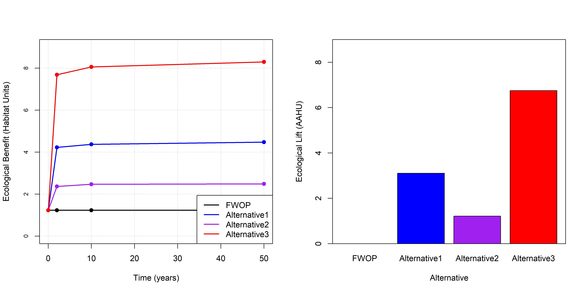
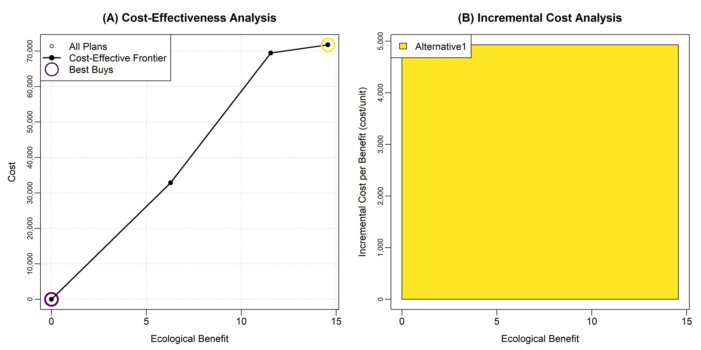
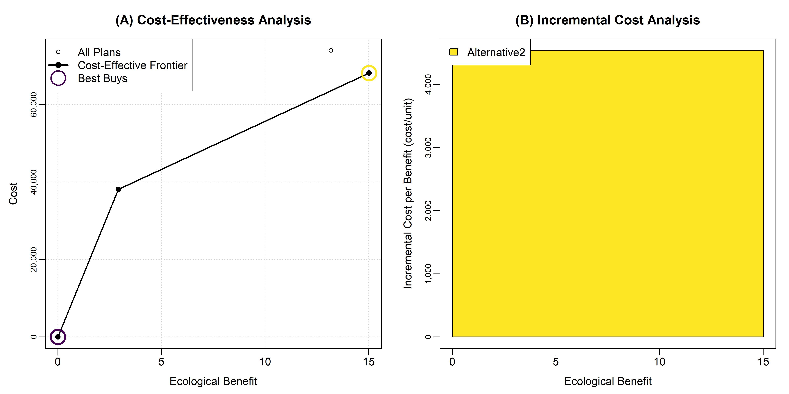
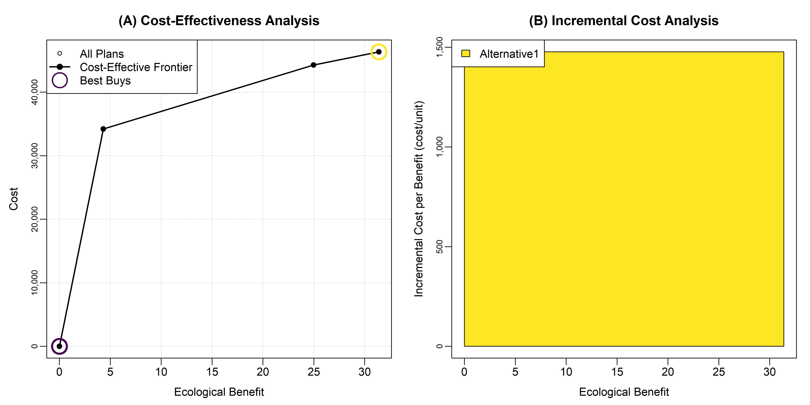
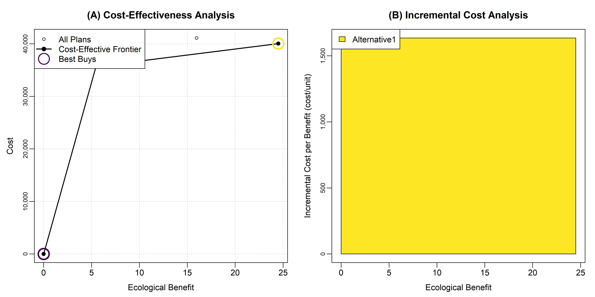
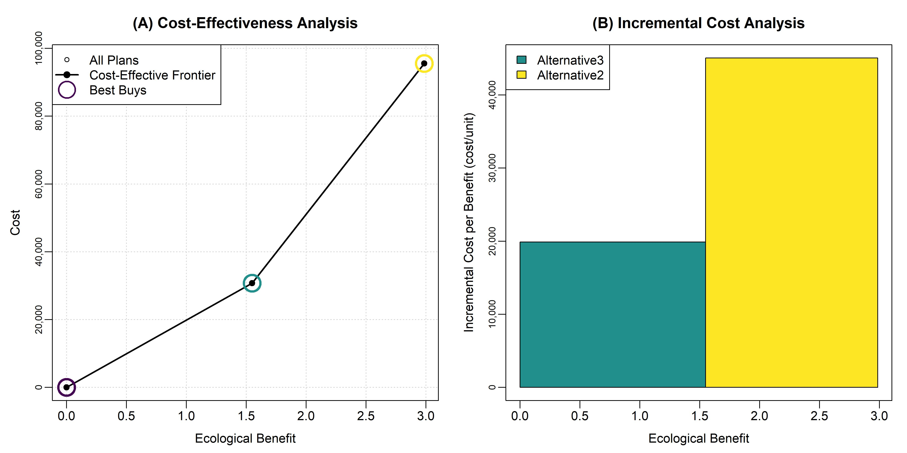

**Corresponding Author**:  
Kyle McKay, PhD, PE  
Environmental Laboratory (EL)  
U.S. Army Engineer Research and Development Center (ERDC)  
U.S. Army Corps of Engineers (USACE)  
Email: kyle.mckay@usace.army.mil

**Model Accessibility**: An interactive version of this report may be accessed [here](https://usace-wrises.github.io/UtoyDecisions/). The underlying numerical code as well as an MS Word version of this analysis may be downloaded from [this github repository](https://github.com/USACE-WRISES/UtoyDecisions).

**Disclosure**: This website represents a preliminary and working version of decision models for a stream restoration study in Utoy Creek, Atlanta, Georgia. The project is led by the Mobile District of the U.S. Army Corps of Engineers (USACE) in partnership with the City of Atlanta. This site **DOES NOT** reflect agency findings or outcomes, and this is merely intended as documentation of methods and working notes for internal use. Please refer to the project manager for the Utoy Creek study, Alex Smith (alexandria.n.smith@usace.army.mil), for up-to-date information about the project. A final version of this report will ultimately be included as an appendix to the more detailed feasibility study report.  


```{r options, include=FALSE}
#Markdown options
knitr::opts_chunk$set(echo=FALSE, warning=FALSE, message = FALSE) 

##########
#Clear local memory
rm(list=ls(all=TRUE))

##########
#Load R package containing CEICA
library(ecorest)

#Load R package containing cost engineering functions
library(EngrEcon)

#Load R package containing color palette
library(viridis)

##########
#IMPORT ALL UTOY DATA

#Import ecological modeling inputs
eco <- read.csv("Utoy_Phase 2_EcoInputs_2024-08-05_EcoIn.csv", header=TRUE, dec=".", na.strings="NA", stringsAsFactors = FALSE)

#Import cost data
cost <- read.csv("Utoy_Phase 2_EcoInputs_2024-08-05_CostIn.csv", header=TRUE, dec=".", na.strings="NA", stringsAsFactors = FALSE)
```


# **1. Introduction**   

The Utoy Creek watershed drains the southwest portion of the City of Atlanta into the Chattahoochee River (Figure 1). This small-to-middle order stream is within the Piedmont region of the southeastern United States, and Utoy Creek exhibits many common characteristics of regional streams such as historical channel degradation due to poor sediment management as well  modern challenges like flashy runoff from urban development. The majority of Utoy Creek's watershed is situated within City of Atlanta boundaries; however, downstream portions of the watershed are within Fulton County. Two main tributaries, North and South Utoy Creeks, unite to form the main stem approximately five miles upstream the Chattahoochee River (EPA, 2016). The total combined length of the main stem and primary tributaries is approximately 22 miles (Walker, 2016).  Including sub-tributaries, the total length of stream is over 50 miles in the Utoy Creek watershed. The total drainage basin is approximately 33.7 square miles with 64% developed and 18% impervious.  


In partnership with the City of Atlanta, the USACE's Mobile District is leading a feasibility study of potential stream restoration actions in the Utoy Creek watershed. The study is authorized through the USACE's continuing authorities program for aquatic ecosystem restoration (Section 206, WRDA 1996). In summer 2023, the project development team conducted preliminary project planning activities such as identification of problems and opportunities, setting ecosystem restoration objectives, and screening potential restoration sites. From fall 2023 to summer 2024, the project development team advanced restoration planning through actions such as field data collection, design of alternatives, ecological modeling, cost estimation, analysis of socio-economic benefits, and public and interagency meetings. This report summarizes various aspects of these activities for the purpose of informing restoration decisions and recommendations for the study as a whole. Specifically, this document presents cost-effectiveness and incremental cost analyses to guide development of the agency's recommended restoration plan.

Cost-effectiveness and incremental cost analyses (CEICA) are a set of methods for comparing non-monetary ecological benefits with monetary investment costs. Cost-effectiveness analysis provides a mechanism for examining the efficiency of alternative actions (Robinson et al. 1995). An "efficiency frontier" identifies all plans that efficiently provide benefits on a *per cost basis*. Incremental cost analysis is conducted on the set of cost-effective plans. This technique sequentially compares each plan to all higher cost plans to reveal changes in unit cost as output levels increase and eliminates plans that do not efficiently provide benefits on an *incremental unit cost basis*. Collectively, these techniques help USACE planning teams assess the question of "Is the next increment of ecological benefit worth the next increment of investment cost?"

This report applies CEICA in multiple contexts to inform decisions in the Utoy Creek watershed. In Chapter 2, the overarching project planning framework is presented that includes the plan formulation strategy along with an overview of ecological benefits and cost estimates. These data provide the fundamental inputs to CEICA and are presented here to contextualize decision making. Additional information on these analyses may be found in other portions of the feasibility report documents. In Chapter 3, CEICA is conducted for individual restoration sites separately to identify recommended outcomes based on ecological criteria (i.e., the authorized purpose). Chapter 4 conducts CEICA at the watershed-scale using the site-scale recommendations from the prior chapter with the goal of identifying an effective portfolio of investments based on ecological benefits. In Chapter 5, a more comprehensive view of project benefits is undertaken by applying CEICA to understand the effects of portfolios of actions on social outcomes. Chapter 6 concludes with a synthesis of the recommendations from prior analyses.


# **2. Project Planning Framework**   

Decision support modeling builds from the planning framework established for a restoration study as a whole. As such, this chapter briefly reviews major components of restoration planning in Utoy Creek. 

## *Plan Formulation Strategy*

Restoration project planning sets the stage for all other design, analysis, or decision tasks. A sound plan formulation strategy clearly articulates a problem statement and objectives from which all choices about design or analysis flow (McKay et al. 2012). The USACE project development team identified objectives for the Utoy Creek restoration project through three primary means. First, USACE policies and budget criteria were used as a template for local objectives. Second, existing local plans and studies in the Utoy Creek watershed were examined. Third, project objectives were compiled from prior studies in the region (e.g., Proctor Creek and Butler Creek). Fourth, preliminary objectives were presented to technical and non-technical stakeholders at a charrette in May 2023. Based on these approaches, the following objectives were identified. **CHECK THAT THESE ARE CONSISTENT WITH THE BROADER STUDY OBJECTIVES.** 

*Overarching objective: Improve instream conditions suitable for a diversity of aquatic organisms (e.g., fish, crayfish, salamanders, benthic macroinvertebrates, turtles)*.  

- Restore channel geomorphic conditions to less disturbed conditions.  
- Reduce sediment loading from the stream bed and banks.  
- Increase instream habitat for a diverse assemblage of local fauna.  
- Increase connectivity of movement corridors for aquatic species

*Overarching objective: Improve riparian conditions supportive of a diverse aquatic and riparian community*.  

- Restore natural sources of organic carbon (i.e., energy) within the system.  
- Increase floodplain connectivity to support biogeochemical cycling.  
- Improve temperature and light regimes.  
- Increase riparian habitat to support native biodiversity.  
- Increase connectivity of movement corridors for riparian species

*Overarching Objective: Restore flow regimes to a best attainable condition*.

- Decrease peak flows.  
- Decrease hydrologic flashiness.  
- Improve watershed capacity to attenuate high flows.

*Secondary Objectives: Pursue socio-economic outcomes while restoring instream and riparian systems*.  

- Increase resiliency to disturbances (e.g., watershed development, climate change, large floods).  
- Promote social benefits and equity.  
- Promote aesthetics and recreation.  
- Improve water quality (e.g., TSS, zinc, nutrients).

In pursuit of these objectives, different information was required as planning proceeded from early watershed problem screening to feasibility-level design. The USACE project development team developed a three-phase approach to analysis of the Utoy Creek watershed restoration (Table 1). In phase 1, activities focused on screening sites to a focal set of locations aligned with USACE objectives. This phase used a suite of high-level assumptions and preliminary data on ecological benefits and costs to reduce 60+ potential restoration locations to a more workable 20 sites for more detailed analysis. Phase 2 focused on feasibility-scale analysis of these 20 sites including collection of additional field and analytical data, development of conceptual designs, execution of ecological models, and estimation of parametric cost. This phase ultimately focused on producing site-scale recommendations of restoration actions. Phase 3 examined the portfolio of recommended actions at the watershed-scale, which are analyzed based on ecological outcomes as well as other project effects (i.e., development of a narrative about the "comprehensive" socio-economic benefits of an investment). These phases required a series of assumptions regarding each analytical step, which are briefly presented in Table 1. Additional information on discipline-specific assumptions can be found elsewhere in feasibility documents.

```{r echo=FALSE}
#Create empty table
Table01 <- as.data.frame(matrix(NA, nrow = 7, ncol = 4))
colnames(Table01) <- c("Scoping Issue", "Site Screening (Aug 2023)", "Site-Scale Analysis (Chapter 3)", "Watershed-Scale Analysis (Chapter 4)")

#Specify rows of the table
Table01[1,] <- c("Primary purpose of analysis", "Screen out sites to a smaller set for more detailed data collection and analysis", "Identify cost-effective restoration actions at each site.", "Develop an effective portfolio of sites for the watershed.")
Table01[2,] <- c("Formulation of alternatives", "ERDC identification of a conceptual action based largely on channel evolution", "Field-based identification of needs followed by multi-disciplinary discussion of actions into a conceptual plan, which was then formalized into a suite of actions and quantities", "All combinations of sites with recommended actions")
Table01[3,] <- c("Number of sites", "60+ reaches", "8 reaches", "4-6 reaches")
Table01[4,] <- c("Number of alternatives", "Two at each site: future without project and maximum build out", "Four at each site: future without project, maximum build-out, two intermediate solutions with varying levels of cost and benefit", "One per site")
Table01[5,] <- c("Cost Estimation", "Rapid, qualitative cost estimates based on prior unit cost", "Site-specific, alternative-specific parameteric cost", "Class 3 estimates for the recommended actions")
Table01[6,] <- c("Real Estate", "None", "Number of parcels intersected", "Appraised cost")
Table01[7,] <- c("Ecological Benefits", "Scoring sites relative to project objectives.", "Separate instream (UIM) and riparian (REFI) models parameterized by a combination of field measurements and analyses. See Figure 1.", "Sum of site-scale habitat units for the recommended action.")
Table01[8,] <- c("Treatment of Time", "Snapshot with and without project (i.e., no temporal forecast)", "Temporal trajectories over 50-year horizon based on years 0, 2, 10, and 50 and annualized over the life of the project", "Use of annualized benefits and costs from site-scale recommendations")
Table01[9,] <- c("Other Social Effects", "Preliminary scoring for relative comparison among divergent sites", "None", "Combined metric based on field assessment, census data, and public input, which is aggregated for groups of nearby sites")
Table01[10,] <- c("Regional Economic Development", "None", "None", "None")
Table01[11,] <- c("National Economic Development", "None", "None", "None")

#Send output table rows into a single matrix
rownames(Table01) <- NULL
knitr::kable(Table01, caption="Table 1. Overview of the three-phase approach to Utoy Creek analyses.", align="c") 
```


This report focuses on examining the relative merits of different restoration actions at a site-scale as well as the merits of those actions at a watershed-scale. Decision-analysis is intimately tied to the development of decision alternatives (i.e., one never recommends an alternative not considered). Therefore, the plan formulation strategy is briefly reviewed for the site- and watershed-scale activities (i.e., Phases 2 and 3). For each potential restoration site, the entirety of the site was visited by walking the length of the reach in large interdisciplinary teams ([map and photos available here](https://www.google.com/maps/d/viewer?mid=1Q_I-vojsBeAUaEz5fVSjcfW30KlTjYk&ll=33.73601955818017%2C-84.46264131161688&z=17)). During these visits, preliminary restoration concepts were discussed and appropriate measures were identified. Following field activities, a series of working meetings were conducted to refine these ideas into conceptual alternatives. The interactive software miro was used to facilitate input and notes from all disciplines and team members. These [miro boards](https://miro.com/app/board/uXjVN9DAdvA=/) served as a knowledge gathering space for conceptual alternatives. Site-scale actions were then formalized into design-oriented formats to asses quantities of restoration needed for ecological and cost models. Site-scale recommendations were developed independently (Chapter 3), and then all permutations of sites were considered at the watershed scale (Chapters 4 and 5).

## *Ecological Models*

Given a set of site-scale alternatives, an analysis of ecological benefits is required to quantitatively compare the relative merits of actions. For Utoy Creek, two ecological models were used to assess instream and riparian outcomes with the intent of directly aligning models with the project objectives identified above (Figure 2). The Riparian Ecosystem Function Index (REFI) is a generic ecological model being developed by ERDC (Wiest et al. *Forthcoming*) with the explicit goal of assessing the ecological importance and integrity of riparian zones, which can be conceptualized as everything from the top-of-bank outward. The Utoy Instream Model (UIM) was developed for this project to capture all aquatic benefits, and the domain of this model can be conceptualized as everything from streambank-to-streambank. 


The Riparian Ecosystem Function Index (REFI) was developed as a rapid method for quantifying ecological benefits of riparian zones. Specifically, the model was designed to complement a [huge variety of stream models](https://gtmenichino.github.io/RiverEngineeringResources/assessment), which typically consider riparian zones only as a benefit to stream functions (rather than as ecologically beneficial in their own right). The model assesses outcomes relative to three overarching functions, which result in module-scale indices that are then arithmetically averaged into an overarching index (i.e., a zero to one metric of quality). The first module focuses on a traditional notion of riparian zones tied to stream functions and addresses issues such as hydrologic attenuation and nutrient uptake. The second module addresses the role of riparian areas as habitats for unique assemblages of organisms. The third module examines the role of riparian areas as migratory pathways for organisms moving laterally from channel to floodplain (e.g., salamanders) as well as longitudinally along river corridors. As of August 2024, REFI has not been certified according to USACE review procedures, but documentation is in development and certification is anticipated late in 2024.

```{r}
#Riparian Ecological Functions Index (REFI) - functional form based on Wiest et al. (in review)
  #Instream inputs: wat_runoff is a 0-15 score associated with watershed runoff. hyd_conn is a 0-15 score associated with hydrologic connectivity of the floodplain. streambank is a 0-15 score associated with streambank processes. energy_nut is a 0-15 score associated with energy and nutrient flows. rip_filter is a 0-15 score associated with riparian filtering. 
  #Habitat inputs: plant_comm is a 0-15 score associated with plant community integrity. canopy is a 0-15 score associated with canopy habitat complexity. understory is a 0-15 score associated with understory processes. floor is a 0-15 score associated with forest floor habitats. stream_hab is a 0-15 score associated with stream integrity.  
  #Connectivity inputs: lateral is a 0-15 score associated with lateral movement corridors. longitudinal is a 0-15 score associated with longitudinal movement corridors. 

REFI <- function(wat_runoff, hyd_conn, streambank, energy_nut, rip_filter, plant_comm, canopy, understory, floor, stream_hab, lateral, longitudinal){
  #Create empty data frame to store outputs
  REFI.out <- as.data.frame(matrix(NA, nrow = 1, ncol = 4))
  colnames(REFI.out) <- c("instream", "habitat", "connectivity", "total")
  
  #Compute instream outcomes
  REFI.out$instream <- (wat_runoff / 15 + hyd_conn / 15 + streambank / 15 + energy_nut / 15 + rip_filter / 15) / 5
  
  #Compute habitat outcomes
  REFI.out$habitat <- (plant_comm / 15 + canopy / 15 + understory / 15 + floor / 15 + stream_hab / 15) / 5
  
  #Compute connectivity outcomes
  REFI.out$connectivity <- (lateral / 15 + longitudinal / 15) / 2
  
  #Compute overarching index of ecosystem condition
  REFI.out$total <- (REFI.out$instream + REFI.out$habitat + REFI.out$connectivity) / 3
  
  #Send output from function
  REFI.out
}
```

The Utoy Instream Model (UIM) was developed for this feasibility study to closely align quantitative outcomes with project objectives. The models are directly tied to and built from ecological models used to quantify restoration outcomes in the neighboring Proctor Creek watershed (McKay et al. 2018ab). Additional functions and outcomes were added to these models in order to align the UIM with other stream functions (Fischenich 2006) as well as newer stream assessment approaches (McKay et al. 2024). The UIM is organized around four modules, which roughly correspond to the widely used stream functions pyramid (Harman et al. 2012). For the UIM, functions related to hydrology and hydraulics were combined to better align with the USACE's budget criteria for ecosystem restoration (i.e., "hydrologic character"). There is no plan to certify the UIM, although the model is based heavily on two certified models, the Proctor Creek Ecological Model (McKay et al. 2018ab) and the Qualitative Habitat Evaluation Index for Louisville Streams (McKay et al. 2024). 

```{r}
#Utoy Instream Model - functional form
  #Hydrology and hydraulic inputs: bhr_score is a 0-20 score associated with bank height ratio (a metric of channel degradation). vel_bf_site is the bankfull velocity at the focal site based on preliminary hydraulic modeling. vel_bf_ref is the bankfull velocity at a reference site based on regional hydraulic geometry. area_bf_site is the bankfull area at the focal site based on preliminary hydraulic modeling. area_bf_ref is the bankfull area at a reference site based on regional hydraulic geometry
  #Geomorphic inputs: geo_alteration is a 0-20 score for channel alteration. geo_evolution is a 0-20 score reflecting geomorphic change and channel evolution. geo_bank is a 0-20 metric for bank stability. geo_behi is a normalized 0-1 version of the Bank Erosion Hazard Index.
  #Habitat inputs: hab_cover is a 0-20 score for aquatic habitat and available cover. large_wood is a 0-20 score for the role of large wood in channel process. velocity_depth is a 0-20 score for diversity of hydraulic habitats. substrate is a 0-20 score for substrate, deposition, and embeddedness.  
  #Connectivity inputs: aop_score is a 0-20 score for animal movement in a general sense. transport_score is a 0-20 score for movement of large wood, sediment, and water. passage_rate is a 0-1 value of fish passage based on the SARP methodology for barrier survey. 

UIM <- function(bhr_score, vel_bf_site, vel_bf_ref, area_bf_site, area_bf_ref, geo_alteration, geo_evolution, geo_bank, hab_cover, large_wood, velocity_depth, substrate, aop_score, transport_score, passage_rate){
  #Create empty data frame to store outputs
  UIM.out <- as.data.frame(matrix(NA, nrow = 1, ncol = 5))
  colnames(UIM.out) <- c("hydro", "geomorph", "habitat", "conn", "total")
  
  #Compute hydrologic and hydraulic outcomes
  UIM.geo.vel <- ifelse(vel_bf_site > 2* vel_bf_ref, 0, 1 - abs(vel_bf_ref - vel_bf_site) / vel_bf_ref)
  UIM.geo.area <- ifelse(area_bf_site > 2* area_bf_ref, 0, 1 - abs(area_bf_ref - area_bf_site) / area_bf_ref)
  UIM.out$hydro <- (bhr_score/20 + UIM.geo.vel + UIM.geo.area) / 3
  
  #Compute geomorphic outcomes
  UIM.out$geomorph <- (geo_alteration / 20 + geo_evolution / 20 + geo_bank / 20) / 3
  
  #Compute habitat outcomes
  UIM.out$habitat <- (hab_cover / 20 + large_wood / 20 + velocity_depth / 20 + substrate / 20) / 4
  
  #Compute connectivity outcomes
  UIM.out$conn <- (aop_score/20 + transport_score/20 + passage_rate) / 3
  
  #Compute overarching index of ecosystem condition
  UIM.out$total <- (UIM.out$hydro + UIM.out$geomorph + UIM.out$habitat + UIM.out$conn) / 4
  
  #Send output from function
  UIM.out
}
```

The quantitative tools for both models are [described elsewhere](https://usace-wrises.github.io/UtoyEcoMod/) in the feasibility report. In general, all models were documented and tested according to best practices in ecological modeling (Grant and Swannack 2008, McKay et al. 2022). Data were stored in a centralized database, which can be downloaded from [this report's github repository](https://github.com/USACE-WRISES/UtoyDecisions). Both models were executed using the [R Statistical Software](https://cran.r-project.org/), and code is available in the same repository. 

Each model was executed for four points in time for all alternatives. Year-0 was assumed to be the existing condition and represents the pre-restoration, degraded condition of the site. Year-2 represents a point in time reflecting an initial increase in ecological benefits associated with the project actions. In general, this time frame reflects most instream benefits of the project, but riparian outcomes would not fully be captured. Year-10 was then assessed as a representative time frame for obtaining many of the riparian benefits of actions. Year-50 represents a fully mature site with a developed multi-story riparian canopy and instream conditions adjusted to a new dynamic equilibrium. For all sites, the future without project was assumed equal to the existing condition, which assumes no future degradation. 

Instream and riparian outcomes were summarized as "habitat units" capturing the quantity and quality of the ecosystem at a given point in time. The model outputs were summed to derive a metric of the overall ecological benefit of ecosystem restoration. Table 2 presents an example of ecological model outputs for each time frame at Site-17F in the Utoy Creek watershed. 

```{r}
#Dataset size
ndata <- length(eco$ReachID)

#Summary info on sites 
sites <- unique(eco$ReachID)
nsites <- length(sites)

#Isolate restoration alternatives for each site
alts <- list()
for(i in 1:nsites){alts[[i]] <- cost$SiteAction[which(cost$ReachID == sites[i])]}

#Count the number of actions at each site
nactions <- c()
for(i in 1:nsites){nactions[i] <- length(alts[[i]])}
nactions.total <- sum(nactions)


##########
#Create empty data frame for storing results
utoy <- data.frame(matrix(NA, nrow=ndata, ncol=13))
colnames(utoy) <- c("ReachID", "SiteAction", "Year", "RipL.Qual", "RipL.Area", "RipL.HU", "RipR.Qual", "RipR.Area", "RipR.HU", "Ins.Qual", "Ins.Area", "Ins.HU", "TOTAL.HU")

utoy$ReachID <- eco$ReachID
utoy$SiteAction <- eco$SiteAction
utoy$Year <- eco$Year

#Loop over all rows in data set
for(i in 1:ndata){
  #RIPARIAN OUTCOMES - LEFT
  #REFI(wat_runoff, hyd_conn, streambank, energy_nut, rip_filter, plant_comm, canopy, understory, floor, stream_hab, lateral, longitudinal)
  utoy$RipL.Qual[i] <- REFI(eco$Watershed_Runoff_left[i], eco$Hydrologic_Connection_left[i], eco$Stream_Habitat_left[i], eco$Energy_Nutrients_Sediment_left[i], eco$Riparian_Filtering_left[i],
                            eco$Plant_Community_left[i], eco$Canopy_Habitat_left[i], eco$Understory_Habitat_left[i], eco$Floor_Habitat_left[i], eco$Stream_Habitat_left[i], 
                            eco$Lateral_Processes_left[i], eco$Longitudinal_Movement_Habitat_left[i])$total
  utoy$RipL.Area[i] <- eco$Riparian_Area_ac_left[i]
  utoy$RipL.HU[i] <- utoy$RipL.Qual[i] * utoy$RipL.Area[i]
  
  #RIPARIAN OUTCOMES - RIGHT
  #REFI(wat_runoff, hyd_conn, streambank, energy_nut, rip_filter, plant_comm, canopy, understory, floor, stream_hab, lateral, longitudinal)
  utoy$RipR.Qual[i] <- REFI(eco$Watershed_Runoff_right[i], eco$Hydrologic_Connection_right[i], eco$Stream_Habitat_right[i], eco$Energy_Nutrients_Sediment_right[i], eco$Riparian_Filtering_right[i],
                            eco$Plant_Community_right[i], eco$Canopy_Habitat_right[i], eco$Understory_Habitat_right[i], eco$Floor_Habitat_right[i], eco$Stream_Habitat_right[i], 
                            eco$Lateral_Processes_right[i], eco$Longitudinal_Movement_Habitat_right[i])$total
  utoy$RipR.Area[i] <- eco$Riparian_Area_ac_right[i]
  utoy$RipR.HU[i] <- utoy$RipR.Qual[i] * utoy$RipR.Area[i]
  
  #INSTREAM OUTCOMES with the Utoy Instream Model (UIM)
  #UIM(bhr_score, vel_bf_site, vel_bf_ref, area_bf_site, area_bf_ref, geo_alteration, geo_evolution, geo_bank, hab_cover, large_wood, velocity_depth, substrate, aop_score, transport_score, passage_rate)
  utoy$Ins.Qual[i] <- UIM(eco$Bank_Height_Ratio[i], eco$Site_Velocity_ft_s[i], eco$Reference_Velocity_ft_s[i], eco$Site_Area_ft2[i], eco$Reference_Area_ft2[i],
    eco$Channel_Alteration[i], eco$Channel_Stability_Evolution[i], eco$Bank_Stability[i],
    eco$Habitat_Available_Cover[i], eco$Large_Wood[i], eco$Velocity_Depth_Regime[i], eco$Substrate_Deposition_Embeddedness[i],
    eco$Aquatic_Organism_Passage[i], eco$Material_Transport[i], eco$Passage_Rate[i])$total
  utoy$Ins.Area[i] <- (eco$Reach_Length_ft[i] * eco$Reach_Top_Width_ft[i]) / 43560
  utoy$Ins.HU[i] <- utoy$Ins.Qual[i] * utoy$Ins.Area[i]
  
  #TOTAL HABITAT
  utoy$TOTAL.HU[i] <- utoy$RipL.HU[i] + utoy$RipR.HU[i] + utoy$Ins.HU[i]
}

##########
#SHOW AN EXAMPLE SITE (17F)
Table02 <- cbind(utoy$ReachID, utoy$SiteAction, utoy$Year,
                 round(utoy$RipL.Qual,2), 
                 round(utoy$RipL.Area,2), 
                 round(utoy$RipL.HU,2), 
                 round(utoy$RipR.Qual,2), 
                 round(utoy$RipR.Area,2), 
                 round(utoy$RipR.HU,2),
                 round(utoy$Ins.Qual,2), 
                 round(utoy$Ins.Area,2), 
                 round(utoy$Ins.HU,2),
                 round(utoy$TOTAL.HU,2))
Table02 <- Table02[1:16,]
colnames(Table02) <- c("Site", "Alternative", "Year", 
                       "Riparian Quality, Left", "Riparian Area, Left (ac)", "Riparian Habitat, Left (HU)",
                       "Riparian Quality, Right", "Riparian Area, Right (ac)", "Riparian Habitat, Right (HU)",
                       "Instream Quality", "Instream Area (ac)", "Instream Habitat (HU)",
                       "Total Habitat (HU)")
rownames(Table02) <- NULL
knitr::kable(Table02, caption="Table 2. Example of ecological benefits computations for Site-17F2M.", align='c') 
```

Ecological models were executed for specific points in time over the project life, but decision models require a time-averaged or "annualized" metric of ecological benefit for comparison with monetary investments. Ecological outcomes were annualized using the [ecorest](https://cran.r-project.org/web/packages/ecorest/index.html) R-package (McKay and Hernandez-Abrams 2020). Figure 3 shows an example of the annualization process for all alternatives at Site-17F to demonstrate methodologically how annualization works. Additionally, all ecological outcomes are presented as the net effect of restoration actions over the future without project condition, which is frequently called "ecological lift."

```{r}
#BENEFIT ANNUALIZATION
#Specify temporal assessment points for analysis
time <- c(0,2,10,50)

#Loop over each site and alternative annualizing outcomes
AAHU <- data.frame(matrix(NA, nrow=nactions.total, ncol=7))
colnames(AAHU) <- c("ReachID", "SiteAction", "RipL", "RipR", "Ins", "Total", "Lift")

#Populate with site and alternative names
AAHU$ReachID <- cost$ReachID
AAHU$SiteAction <- cost$SiteAction

for(i in 1:nactions.total){
  #Isolate the correct site and alternative
  site.alt.temp <- which(eco$ReachID == AAHU$ReachID[i] & eco$SiteAction == AAHU$SiteAction[i] & eco$HydroAction == "None")
  
  #Annualize benefits (first removing NAs)
  AAHU$RipL[i] <- annualizer(time, as.numeric(utoy$RipL.HU[site.alt.temp]))
  AAHU$RipR[i] <- annualizer(time, as.numeric(utoy$RipR.HU[site.alt.temp]))
  AAHU$Ins[i] <- annualizer(time, as.numeric(utoy$Ins.HU[site.alt.temp]))
  AAHU$Total[i] <- sum(AAHU$RipL[i], AAHU$RipR[i], AAHU$Ins[i])
}

#Loop over each site calculating lift
for(i in 1:nsites){
  #Isolate the location of all actions for this site
  sites.AAHU.temp <- which(AAHU$ReachID == sites[i])
  
  #Isolate the location of the FWOP for this site
  FWOP.temp <- which(AAHU$ReachID == sites[i] & AAHU$SiteAction == "FWOP")
  
  #Compute lift
  AAHU$Lift[sites.AAHU.temp] <- AAHU$Total[sites.AAHU.temp] - AAHU$Total[FWOP.temp]
}

##########
#SHOW AN EXAMPLE OF A TIME SERIES (17F)

#Create plot to present annualization data
jpeg(filename="Utoy_Annualization.jpeg", width = 6, height = 6, units = "in", res = 400)

#Create the shell of the plot
plot(c(0, 1), c(0, 1), type = "n", 
     xlim = c(0,50), ylim = c(0,7), axes = FALSE, 
     xlab="Time (years)", ylab="Ecological Benefit (Habitat Units)", main="")
axis(1)
axis(2, at = axTicks(2), labels = prettyNum(axTicks(2), big.mark = ",", scientific = FALSE), las = 0, cex.axis = 0.75, tick = TRUE)

#Turn on grid lines
grid(); box()

#Add FWOP
lines(c(0,2,10,50), utoy$TOTAL.HU[1:4], lwd = 2, col="black")
points(c(0,2,10,50), utoy$TOTAL.HU[1:4], pch = 19, cex = 1, col = "black")

#Add Alternative 1
lines(c(0,2,10,50), utoy$TOTAL.HU[5:8], lwd = 2, col="blue")
points(c(0,2,10,50), utoy$TOTAL.HU[5:8], pch = 19, cex = 1, col = "blue")

#Add Alternative 2
lines(c(0,2,10,50), utoy$TOTAL.HU[9:12], lwd = 2, col="purple")
points(c(0,2,10,50), utoy$TOTAL.HU[9:12], pch = 19, cex = 1, col = "purple")

#Add Alternative 3
lines(c(0,2,10,50), utoy$TOTAL.HU[13:16], lwd = 2, col="red")
points(c(0,2,10,50), utoy$TOTAL.HU[13:16], pch = 19, cex = 1, col = "red")

#Add legend
legend("bottomright", legend = c("FWOP", "Alternative1", "Alternative2", "Alternative3"), lwd = 2, col = c("black", "blue", "purple", "red"), bg = "white")

#Turn off plot device
invisible(dev.off())
```




## *Monetary Costs*

Cost estimates were compiled for each site-scale restoration action following standard cost engineering methods. At this phase, construction cost represents a parametric cost for comparative purposes only, which is largely confined to construction activities. No real estate, pre-construction engineering and design, construction management, or cultural resources costs were included at present.  

Monitoring and adaptive management are typically conducted over a ten-year window for ecosystem restoration projects (WRDA 2007, Section 2036). Monitoring cost was estimated for four points in time, a sampling event during pre-construction engineering design as well as sampling in years 1, 3, and 5 following construction. Each sampling event assumed collection of data on fish communities, invertebrate communities, bathymetric mapping, and hydraulic outcomes. Adaptive management was estimated a proportion of construction cost ranging between 7.5% and 25% depending on site- and alternative-complexity. **MONITORING COSTS SEEM HIGH RELATIVE TO ADAPTIVE MANAGEMENT COSTS.**

Operations, maintenance, repair, replacement, and rehabilitation (OMRRR) costs were estimated relative to four common practices. First, quarterly site visits were planned for general maintenance to any small-scale restoration features, trash removal, and minor maintenance of educational features (signage, benches, or classrooms) at a cost of \$10,000 per year. Second, bi-annual site visits were planned to include a simple inspection, which were estimated as \$4.00 per linear foot of stream every other year. Third, invasive species removal was estimated to cost \$15,000 per site and occur once every 10-years. Fourth, repair of structural restoration features (e.g., rock, wood, and earth work) was assumed to occur once every 25 years. These estimates resulted in OMRRR costs ranging from 1.2% to 16.7% or construction cost depending on the site and alternative (Appendix B, Table B1), which is approximately in line with other stream restoration projects (Abera and McKay 2023). **OMRRR VALUES WERE ALTERED SIGNIFICANTLY TO BREING THEM IN LINE WITH COMMON RANGES.**

Average annual economic costs were computed for all cost categories. Interest during construction was computed based on construction costs with site- and alternative-specific construction durations. The FY24 Federal discount rate (2.75%, USACE 2023) was used to annualize construction cost, interest during construction, and monitoring and adaptive management expenses over a 50-year planning horizon. Cost data were annualized using the [EngrEcon](https://cran.r-project.org/web/packages/EngrEcon/index.html) software package, although a [web application](https://wrises.shinyapps.io/engrecon-webapp/) also exists for conducting these calculations. Table 3 provides an example of cost estimates for Site-17F, and Table B03 in Appendix B provides a cost summary for all sites and actions.


```{r}
#COST ANNUALIZATION

#Set federal discont rate for water resources projects in FY24
discount <- 0.0275

##########
#Compute OMRRR
cost_OMRRR_present <- data.frame(matrix(NA, nrow=nactions.total, ncol=10))
colnames(cost_OMRRR_present) <- c("ReachID", "SiteAction", "RipArea_ft2", "Reach_Length_ft", "ProjectFirst", "Inspection_Trash", "Invasives", "Wood_Rock_Earth", "General", "Total")

#Populate some values from input data
cost_OMRRR_present$ReachID <- cost$ReachID
cost_OMRRR_present$SiteAction <- cost$SiteAction
cost_OMRRR_present$ProjectFirst <- cost$Project_First

#Isolate riparian area and reach length for year-50
for(i in 1:nactions.total){
  #Isolate the correct site and alternative
  site.alt.temp <- which(eco$ReachID == cost_OMRRR_present$ReachID[i] & eco$SiteAction == cost_OMRRR_present$SiteAction[i] & eco$HydroAction == "None" & eco$Year == 50)
  cost_OMRRR_present$RipArea_ft2[i] <- (eco$Riparian_Area_ac_left[site.alt.temp] + eco$Riparian_Area_ac_right[site.alt.temp]) * 43560
  cost_OMRRR_present$Reach_Length_ft[i] <- eco$Reach_Length_ft[site.alt.temp]
  
  #Override FWOP area and length as zero for purposes of cost estimation
  cost_OMRRR_present$RipArea_ft2[i] <- ifelse(cost_OMRRR_present$SiteAction[i] == "FWOP", 0, cost_OMRRR_present$RipArea_ft2[i])
  cost_OMRRR_present$Reach_Length_ft[i] <- ifelse(cost_OMRRR_present$SiteAction[i] == "FWOP", 0, cost_OMRRR_present$Reach_Length_ft[i])
}

#Calculate OMRRR for each item
for(i in 1:nactions.total){
  cost_OMRRR_present$General[i] <- om_distribute(discount, 50, 1, 10000 * ifelse(cost_OMRRR_present$RipArea_ft2[i]>0, 1, 0))
  cost_OMRRR_present$Inspection_Trash[i] <- om_distribute(discount, 50, 2, 4*cost_OMRRR_present$Reach_Length_ft[i])
  #cost_OMRRR_present$Invasives[i] <- om_distribute(discount, 50, 10, 1.50 * 0.5 * cost_OMRRR_present$RipArea_ft2[i])
  cost_OMRRR_present$Invasives[i] <- om_distribute(discount, 50, 10, 15000 * ifelse(cost_OMRRR_present$RipArea_ft2[i]>0, 1, 0))
  cost_OMRRR_present$Wood_Rock_Earth[i] <- om_distribute(discount, 50, 25, 0.1*cost_OMRRR_present$ProjectFirst[i])
  cost_OMRRR_present$Total[i] <- cost_OMRRR_present$Inspection_Trash[i] + cost_OMRRR_present$General[i] + cost_OMRRR_present$Invasives[i] + cost_OMRRR_present$Wood_Rock_Earth[i]
}

##########
#Create a data frame with all PRESENT VALUE costs
cost_present <- data.frame(matrix(NA, nrow=nactions.total, ncol=7))
colnames(cost_present) <- c("ReachID", "SiteAction", "ProjectFirst", "Monitoring", "AdMan", "IDC", "OM")

  #Populate some values from input data
  cost_present$ReachID <- cost$ReachID
  cost_present$SiteAction <- cost$SiteAction
  cost_present$ProjectFirst <- cost$Project_First
  cost_present$Monitoring <- cost$Monitoring
  cost_present$AdMan <- cost$AdMan
  cost_present$OM <- cost_OMRRR_present$Total
  
  #Loop over each alternative to compute IDC
  for (i in 1:nactions.total){
    cost_present$IDC[i] <- ifelse(cost$Duration_mo[i]==0, 0, interest_during_construction(discount, cost$Duration_mo[i], cost$Project_First[i]))
  }

##########
#Create a data frame with all ANNUALIZED costs
cost_ann <- data.frame(matrix(NA, nrow=nactions.total, ncol=8))
colnames(cost_ann) <- c("ReachID", "SiteAction", "ProjectFirst", "Monitoring", "AdMan", "IDC", "OM", "Total")

  #Populate some values from input data
  cost_ann$ReachID <- cost$ReachID
  cost_ann$SiteAction <- cost$SiteAction
  
  #Annualize construction cost and IDC over 50 year horizon
  cost_ann$ProjectFirst <- present_to_annual(discount, 50, cost$Project_First)
  cost_ann$IDC <- present_to_annual(discount, 50, cost_present$IDC)
  
  #Annualize monitoring and adaptive management over 10 year horizon
  cost_ann$Monitoring <- present_to_annual(discount, 10, cost$Monitoring)
  cost_ann$AdMan <- present_to_annual(discount, 10, cost$AdMan)
  
  #Annualize OMRRR cost assumed at ten year intervals
  cost_ann$OM <- present_to_annual(discount, 50, cost_present$OM)
  
  #Sum annualized costs
  cost_ann$Total <- cost_ann$ProjectFirst + cost_ann$Monitoring + cost_ann$AdMan + cost_ann$IDC + cost_ann$OM
  
##########
#SHOW AN EXAMPLE SITE (17F)
Table03 <- cbind(cost$ReachID, cost$SiteAction, cost$Duration_mo,
                 formatC(cost$Project_First, format="f", digits=0, big.mark = ","),
                 formatC(cost$Monitoring, format="f", digits=0, big.mark = ","),
                 formatC(cost$AdMan, format="f", digits=0, big.mark = ","),
                 formatC(cost_ann$OM, format="f", digits=0, big.mark = ","),
                 formatC(cost_ann$Total, format="f", digits=0, big.mark = ","))
Table03 <- Table03[1:4,]
colnames(Table03) <- c("Site", "Alternative", "Construction Duration (mo)", 
                       "Construction Cost", "Monitoring Cost", "Adapative Management Cost",
                       "OMRRR Annual Cost", "Total Annualized Cost")
rownames(Table03) <- NULL
knitr::kable(Table03, caption="Table 3. Example of monetary cost data for Site-17F2M.", align='c') 
```


## *Summary of Inputs to CEICA*

Non-monetary ecological benefits and monetary investment costs provide the primary inputs to CEICA. This chapter has examined the methods by which these outcomes were obtained, although other portions of the feasibility report provide greater detail. Table 4 summarizes the benefits and costs of all restoration actions at all sites considered in this analysis. **Is there anything interesting to say about trends in these outcomes at this stage?**

```{r}
#SEND OUTPUT TABLE
Table04 <- cbind(AAHU$ReachID, AAHU$SiteAction,
                 formatC(AAHU$Total, format="f", digits=1, big.mark = ","), 
                 formatC(AAHU$Lift, format="f", digits=1, big.mark = ","), 
                 formatC(cost_present$ProjectFirst, format="f", digits=0, big.mark = ","), 
                 formatC(cost_ann$Total, format="f", digits=0, big.mark = ","),
                 formatC(ifelse(AAHU$Lift > 0, cost_ann$Total / AAHU$Lift, 0), format="f", digits=0, big.mark = ","))
colnames(Table04) <- c("Site", "Alternative", "Ecological Outputs (AAHU)", "Ecological Lift (AAHU)", "Construction Cost", "Annualized Cost", "Unit Cost")
rownames(Table04) <- NULL
knitr::kable(Table04, caption="Table 4. Summary of benefit and cost inputs for each site-scale alternative.", align='c') 
```


# **3. Site-by-site analysis**   

**RESUME EDITING HERE.** In this section, yada yada yada. Blah, blah, blah.  

Cost-effectiveness analysis provides a mechanism for examining the efficiency of alternative actions (Robinson et al. 1995). For any given level of investment, the agency wants to identify the plan with the most return-on-investment (i.e., the most environmental benefits for a given level of cost or the least cost for a given level of environmental benefit). An "efficiency frontier" identifies all plans that efficiently provide benefits on a *per cost basis*. 


Incremental cost analysis is conducted on the set of cost-effective plans. This technique sequentially compares each plan to all higher cost plans to reveal changes in unit cost as output levels increase and eliminates plans that do not efficiently provide benefits on an *incremental unit cost basis*. Specifically, this analysis examines the slope of the cost-effectiveness frontier to isolate how the unit cost ($/unit) increases as the magnitude of environmental benefit increases. Incremental cost analysis is ultimately intended to inform decision-makers about the consequences of increasing unit cost when increasing benefits (i.e., each unit becomes more expensive). Plans emerging from incremental cost analysis efficiently accomplish the objective relative to unit costs and are typically referred to as "best buys." Importantly, all "best buys" are cost-effective, but all cost-effective plans are not best buys. 


For Utoy Creek, CEICA will ultimately be applied at both the site- and watershed-scales in the feasibility study. However, only watershed scale assessments are presented here for the purpose of site screening. Five separate CEICA analyses are undertaken for: (1) the mainstem Utoy Creek and lower Watershed, (2) North Utoy Creek Watershed, (3) South Utoy Creek Watershed, (4) hydrologic restoration actions, and (5) social outcomes. These sets of actions were separately assessed for multiple reasons. First, a separate prioritization more equitably distributes actions across the watershed and allows the USACE team to see portfolios of actions more clearly emerge. Second, hydrologic and social outcomes relied on different metrics, and separate prioritization facilitates comparison of outcomes in a more comprehensive format. Third, the larger number of sites in Utoy Creek (63 sites) creates numerical limitations to studying portfolios of actions (i.e., 9 * 10^18 potential combinations). Because of this numerical constraint, a maximum five restoration actions were allowed in each portfolio. These four planning sets are presented separately below.  

Conduct CEICA for all sites and store results.

```{r}
#Create empty list to store CEICA outcomes and alternative names
CEICA <- list(BB = NULL, ProjectFirst = NULL, altnames.BB = NULL, ProjectFirst.BB = NULL)

#Conduct CEICA
for(i in 1:nsites){
  #Isloate the site for this analysis
  sites.temp <- which(AAHU$ReachID == sites[i])
  alt.temp <- AAHU$SiteAction[sites.temp]
  lift.temp <- AAHU$Lift[sites.temp]
  cost.temp <- cost_ann$Total[sites.temp]
  cost.temp.first <- cost_present$ProjectFirst[sites.temp]

  #Conduct CEICA
  CE.temp <- CEfinder(lift.temp, cost.temp)
  BB.temp <- BBfinder(lift.temp, cost.temp, CE.temp)
  
  #Save BB names and total construction cost
  BB.names.temp <- c()
  BB.cost.total.temp <- c()
  for(j in 1:length(BB.temp[[2]][,1])){
    BBfinder <- which(lift.temp == BB.temp[[2]][j,1] & cost.temp == BB.temp[[2]][j,2])
    BB.names.temp[j] <- paste(sites[i], BBfinder, alt.temp[BBfinder], sep=".")
    BB.cost.total.temp[j] <- cost.temp.first[BBfinder]
  }

  #Make CEICA summary figure
  outputfig.temp <- paste("CEICA.", sites[i],".jpeg", sep="")
  CEICAplotter(alt.temp, lift.temp, cost.temp, CE.temp, BB.temp[[1]][,4], outputfig.temp)

  #Store results
  CEICA$BB[[i]] <- BB.temp
  CEICA$ProjectFirst[[i]] <- cost.temp.first
  CEICA$altnames.BB[[i]] <- BB.names.temp
  CEICA$ProjectFirst.BB[[i]] <- BB.cost.total.temp
}
```


## *Site 17F2M*

This is just placeholder text. Describe the site and alternatives. **EXPECTED Alt 1 and 3 to be competitive. NEED TO REVISIT BENEFITS AND DOUBLE-CHECK AREAS.**  Alternatives 1 and 2 may be more compelling in light of connectivity to 17D2E. 

- FWOP: Future WithOut Project. Significant ecological degradation at the site compels action at this site. 
- Alternative1: Concrete channel removal with extensive riparian restoration.  
- Alternative2: Remove concrete channel with small-scale channel restoration.  
- Alternative3 (**TENTATIVE RECOMMENDATION**): Chain of wetlands. Likely to have large hydrologic and sediment capture benefits, which would protect downstream investments. Line of sight in the golf course would not be impeded. 


```{r}
#Select site to display
i<-1

#Display incremental cost results
BB.output.temp.names <- c("Alt", "Lift (AAHU)", "Avg Ann Cost", "Inc Unit Cost","Construction Cost")
BB.output.temp <- cbind(CEICA$altnames.BB[[i]], formatC(CEICA$BB[[i]][[2]][,1], format="f", digits=2, big.mark = ","),
                        formatC(CEICA$BB[[i]][[2]][,2], format="f", digits=0, big.mark = ","),
                        formatC(CEICA$BB[[i]][[2]][,3], format="f", digits=0, big.mark = ","),
                        formatC(CEICA$ProjectFirst.BB[[i]], format="f", digits=0, big.mark = ","))
colnames(BB.output.temp) <- BB.output.temp.names
knitr::kable(BB.output.temp, caption="Incremental cost summary.", align='c') 

#Display cost-effectiveness results
CE.output.temp.names <- c("Alt", "Lift (AAHU)", "Avg Ann Cost", "Unit Cost","Construction Cost", "CE?", "BB?")
CE.output.temp <- cbind(alts[[i]], formatC(CEICA$BB[[i]][[1]][,1], format="f", digits=2, big.mark = ","),
                        formatC(CEICA$BB[[i]][[1]][,2], format="f", digits=0, big.mark = ","),
                        formatC(CEICA$BB[[i]][[1]][,2]/CEICA$BB[[i]][[1]][,1], format="f", digits=0, big.mark = ","),
                        formatC(CEICA$ProjectFirst[[i]], format="f", digits=0, big.mark = ","),
                        CEICA$BB[[i]][[1]][,3], CEICA$BB[[i]][[1]][,4])
colnames(CE.output.temp) <- CE.output.temp.names
knitr::kable(CE.output.temp, caption="Cost-effectiveness summary.", align='c') 
```


## *Site 17D2E*

This is just placeholder text. Describe the site and alternatives.  

- FWOP: Future WithOut Project. Significant ecological degradation due to the concrete channel at the site compels action at this site.  
- Alternative1 (**RECOMMENDATION**): Concrete channel removal with left bank wetland. Large lift. Direct effect on cause of ecological degradation. Low unit cost relative to watershed-scale actions.   
- Alternative2: Concrete channel removal with bankfull bench. Not a best buy, but a strong option. Mobilization cost compels the larger action (Alternative1).  
- Alternative3: Stabilization with natural bed and grade control. Does not lead to as large of ecological lift, but better than FWOP.




```{r}
#Select site to display
i<-2

#Display incremental cost results
BB.output.temp <- cbind(CEICA$altnames.BB[[i]], formatC(CEICA$BB[[i]][[2]][,1], format="f", digits=2, big.mark = ","),
                        formatC(CEICA$BB[[i]][[2]][,2], format="f", digits=0, big.mark = ","),
                        formatC(CEICA$BB[[i]][[2]][,3], format="f", digits=0, big.mark = ","),
                        formatC(CEICA$ProjectFirst.BB[[i]], format="f", digits=0, big.mark = ","))
colnames(BB.output.temp) <- BB.output.temp.names
knitr::kable(BB.output.temp, caption="Incremental cost summary.", align='c') 

#Display cost-effectiveness results
CE.output.temp <- cbind(alts[[i]], formatC(CEICA$BB[[i]][[1]][,1], format="f", digits=2, big.mark = ","),
                        formatC(CEICA$BB[[i]][[1]][,2], format="f", digits=0, big.mark = ","),
                        formatC(CEICA$BB[[i]][[1]][,2]/CEICA$BB[[i]][[1]][,1], format="f", digits=0, big.mark = ","),
                        formatC(CEICA$ProjectFirst[[i]], format="f", digits=0, big.mark = ","),
                        CEICA$BB[[i]][[1]][,3], CEICA$BB[[i]][[1]][,4])
colnames(CE.output.temp) <- CE.output.temp.names
knitr::kable(CE.output.temp, caption="Cost-effectiveness summary.", align='c') 
```

## *Site 17B*

This is just placeholder text. Describe the site and alternatives. **CONFUSION ABOUT THE ROLE OF BEAVERS. NEED TO REVISIT ECOLOGICAL MODEL INPUTS WITH TJ, GARRETT, LIYA, BRENNA, AND KEVIN.**    

- FWOP: Future WithOut Project.  
- Alternative1: Channel and bank stabilization with beaver removal.  
- Alternative2 (**RECOMMENDATION**): Channel and bank stabilization. Justified by large increase in ecological benefits. Channel degradation appears to be the proximate cause of bank issues. Need to increase adaptive management cost to understand the role of beavers in the system. Need to be mindful of existing riparian zone in refinement of the designs moving forward (access to the site via greenway could mitigate this construction impact). Strong connectivity to upstream investments in 17F2M and 17D2E. Proximity to the greenway and school compels for a larger action. 17C provides bedrock control to minimize risks.   
- Alternative3: Bank stabilization only. Low ecological benefits given the size of the site, Channel degradation is causing bank erosion.




```{r}
#Select site to display
i<-3

#Display incremental cost results
BB.output.temp <- cbind(CEICA$altnames.BB[[i]], formatC(CEICA$BB[[i]][[2]][,1], format="f", digits=2, big.mark = ","),
                        formatC(CEICA$BB[[i]][[2]][,2], format="f", digits=0, big.mark = ","),
                        formatC(CEICA$BB[[i]][[2]][,3], format="f", digits=0, big.mark = ","),
                        formatC(CEICA$ProjectFirst.BB[[i]], format="f", digits=0, big.mark = ","))
colnames(BB.output.temp) <- BB.output.temp.names
knitr::kable(BB.output.temp, caption="Incremental cost summary.", align='c') 

#Display cost-effectiveness results
CE.output.temp <- cbind(alts[[i]], formatC(CEICA$BB[[i]][[1]][,1], format="f", digits=2, big.mark = ","),
                        formatC(CEICA$BB[[i]][[1]][,2], format="f", digits=0, big.mark = ","),
                        formatC(CEICA$BB[[i]][[1]][,2]/CEICA$BB[[i]][[1]][,1], format="f", digits=0, big.mark = ","),
                        formatC(CEICA$ProjectFirst[[i]], format="f", digits=0, big.mark = ","),
                        CEICA$BB[[i]][[1]][,3], CEICA$BB[[i]][[1]][,4])
colnames(CE.output.temp) <- CE.output.temp.names
knitr::kable(CE.output.temp, caption="Cost-effectiveness summary.", align='c') 
```

## *Site 2A*

This is just placeholder text. Describe the site and alternatives. Potential real estate and coordination challenges in the power easement. Minimally, dialog with power company could be productive dialog about bank stabilization methods.  

- FWOP: Future WithOut Project.  
- Alternative1 (**RECOMMENDATION**): Channel realignment. Best buy. Moves stream out of the easement and improves shading (not captured adequately in ecological models). Need to tie in some information on the benefits of stream shading (e.g.,g Rhett Jackson's work at Coweeta). Significant sediment input from banks. Similar cost for more lift than Alternative2.  
- Alternative2: Channel shaping with bankfull bench.  
- Alternative3: Minor instream structures. Not economically competitive given high cost and low benefit. 





```{r}
#Select site to display
i<-4

#Display incremental cost results
BB.output.temp <- cbind(CEICA$altnames.BB[[i]], formatC(CEICA$BB[[i]][[2]][,1], format="f", digits=2, big.mark = ","),
                        formatC(CEICA$BB[[i]][[2]][,2], format="f", digits=0, big.mark = ","),
                        formatC(CEICA$BB[[i]][[2]][,3], format="f", digits=0, big.mark = ","),
                        formatC(CEICA$ProjectFirst.BB[[i]], format="f", digits=0, big.mark = ","))
colnames(BB.output.temp) <- BB.output.temp.names
knitr::kable(BB.output.temp, caption="Incremental cost summary.", align='c') 

#Display cost-effectiveness results
CE.output.temp <- cbind(alts[[i]], formatC(CEICA$BB[[i]][[1]][,1], format="f", digits=2, big.mark = ","),
                        formatC(CEICA$BB[[i]][[1]][,2], format="f", digits=0, big.mark = ","),
                        formatC(CEICA$BB[[i]][[1]][,2]/CEICA$BB[[i]][[1]][,1], format="f", digits=0, big.mark = ","),
                        formatC(CEICA$ProjectFirst[[i]], format="f", digits=0, big.mark = ","),
                        CEICA$BB[[i]][[1]][,3], CEICA$BB[[i]][[1]][,4])
colnames(CE.output.temp) <- CE.output.temp.names
knitr::kable(CE.output.temp, caption="Cost-effectiveness summary.", align='c') 
```

## *Site 2B*

This is just placeholder text. Describe the site and alternatives. Potential real estate and coordination challenges in the power easement. Minimally, dialog with power company could be productive dialog about bank stabilization methods.  

- FWOP: Future WithOut Project.  
- Alternative1 (**RECOMMENDATION**): Channel realignment. Best buy. Moves stream out of the easement and improves shading (not captured adequately in ecological models). Need to tie in some information on the benefits of stream shading (e.g.,g Rhett Jackson's work at Coweeta). Significant sediment input from banks. Similar cost for more lift than Alternative2.  
- Alternative2: Channel shaping with bankfull bench.  
- Alternative3: Minor instream structures. High unit cost.





```{r}
#Select site to display
i<-5

#Display incremental cost results
BB.output.temp <- cbind(CEICA$altnames.BB[[i]], formatC(CEICA$BB[[i]][[2]][,1], format="f", digits=2, big.mark = ","),
                        formatC(CEICA$BB[[i]][[2]][,2], format="f", digits=0, big.mark = ","),
                        formatC(CEICA$BB[[i]][[2]][,3], format="f", digits=0, big.mark = ","),
                        formatC(CEICA$ProjectFirst.BB[[i]], format="f", digits=0, big.mark = ","))
colnames(BB.output.temp) <- BB.output.temp.names
knitr::kable(BB.output.temp, caption="Incremental cost summary.", align='c') 

#Display cost-effectiveness results
CE.output.temp <- cbind(alts[[i]], formatC(CEICA$BB[[i]][[1]][,1], format="f", digits=2, big.mark = ","),
                        formatC(CEICA$BB[[i]][[1]][,2], format="f", digits=0, big.mark = ","),
                        formatC(CEICA$BB[[i]][[1]][,2]/CEICA$BB[[i]][[1]][,1], format="f", digits=0, big.mark = ","),
                        formatC(CEICA$ProjectFirst[[i]], format="f", digits=0, big.mark = ","),
                        CEICA$BB[[i]][[1]][,3], CEICA$BB[[i]][[1]][,4])
colnames(CE.output.temp) <- CE.output.temp.names
knitr::kable(CE.output.temp, caption="Cost-effectiveness summary.", align='c') 
```

## *Site 3E*

This is just placeholder text. Describe the site and alternatives.  

- FWOP (**RECOMMENDATION**): Future WithOut Project. High unit cost relative to other sites compels a lack of investment at this location.  
- Alternative1: Bridge replacement with extensive action. Very high unit cost.  
- Alternative2: Brdige replacement with minor action. Very high unit cost.  
- Alternative3: Bank stabilization. High unit cost relative to other sites.



```{r}
#Select site to display
i<-6

#Display incremental cost results
BB.output.temp <- cbind(CEICA$altnames.BB[[i]], formatC(CEICA$BB[[i]][[2]][,1], format="f", digits=2, big.mark = ","),
                        formatC(CEICA$BB[[i]][[2]][,2], format="f", digits=0, big.mark = ","),
                        formatC(CEICA$BB[[i]][[2]][,3], format="f", digits=0, big.mark = ","),
                        formatC(CEICA$ProjectFirst.BB[[i]], format="f", digits=0, big.mark = ","))
colnames(BB.output.temp) <- BB.output.temp.names
knitr::kable(BB.output.temp, caption="Incremental cost summary.", align='c') 

#Display cost-effectiveness results
CE.output.temp <- cbind(alts[[i]], formatC(CEICA$BB[[i]][[1]][,1], format="f", digits=2, big.mark = ","),
                        formatC(CEICA$BB[[i]][[1]][,2], format="f", digits=0, big.mark = ","),
                        formatC(CEICA$BB[[i]][[1]][,2]/CEICA$BB[[i]][[1]][,1], format="f", digits=0, big.mark = ","),
                        formatC(CEICA$ProjectFirst[[i]], format="f", digits=0, big.mark = ","),
                        CEICA$BB[[i]][[1]][,3], CEICA$BB[[i]][[1]][,4])
colnames(CE.output.temp) <- CE.output.temp.names
knitr::kable(CE.output.temp, caption="Cost-effectiveness summary.", align='c') 
```


## *Site 3F*

This is just placeholder text. Describe the site and alternatives. Note the high adaptive management cost of all of these actions. All actions are innovative and would be strong demonstrations for the region. This site requires a conversation with CoA about risk vs. return vs. innovation. Currently the only site on South Utoy, which may have benefits from the perspective of increasing the geographic distribution of benefits.  

- FWOP: Future WithOut Project.  
- Alternative1 (**RECOMMENDATION**): Large wood features for 50% of reach. Innovative methods for southeast stream restoration using large wood in more explicit ways. Innovative methods compel inclusion of the larger plan. Non-monetary benefits of demonstrating new techniques.  
- Alternative2: Large wood features for 25% of reach. Non-cost-effective.  
- Alternative3: Beaver reintroduction. Cost-effective plan (nearly a best buy). Lots of room for the river at this site, but flood risk needs to be considered further. Experimental action has low-cost, high-reward potential with strong demonstration value for the region as a whole. Uncertain timeframe for benefits with beavers. Downstream bridge crossing with known debris jams. Utility line crossing has a high risk component. Concern about liability of beaver moving off-site into neighboring areas.


```{r}
#Select site to display
i<-7

#Display incremental cost results
BB.output.temp <- cbind(CEICA$altnames.BB[[i]], formatC(CEICA$BB[[i]][[2]][,1], format="f", digits=2, big.mark = ","),
                        formatC(CEICA$BB[[i]][[2]][,2], format="f", digits=0, big.mark = ","),
                        formatC(CEICA$BB[[i]][[2]][,3], format="f", digits=0, big.mark = ","),
                        formatC(CEICA$ProjectFirst.BB[[i]], format="f", digits=0, big.mark = ","))
colnames(BB.output.temp) <- BB.output.temp.names
knitr::kable(BB.output.temp, caption="Incremental cost summary.", align='c') 

#Display cost-effectiveness results
CE.output.temp <- cbind(alts[[i]], formatC(CEICA$BB[[i]][[1]][,1], format="f", digits=2, big.mark = ","),
                        formatC(CEICA$BB[[i]][[1]][,2], format="f", digits=0, big.mark = ","),
                        formatC(CEICA$BB[[i]][[1]][,2]/CEICA$BB[[i]][[1]][,1], format="f", digits=0, big.mark = ","),
                        formatC(CEICA$ProjectFirst[[i]], format="f", digits=0, big.mark = ","),
                        CEICA$BB[[i]][[1]][,3], CEICA$BB[[i]][[1]][,4])
colnames(CE.output.temp) <- CE.output.temp.names
knitr::kable(CE.output.temp, caption="Cost-effectiveness summary.", align='c') 
```

## *Site 19A*

This is just placeholder text. Describe the site and alternatives. Alternative 1 was formulated, but screened out due to constructability during design and cost.  

- FWOP: Future WithOut Project.  
- Alternative2 (**RECOMMENDATION**): Floodplain bench for floodplain connectivity. Best buy. Very low unit cost. Also includes regrading actions from Alternative3.  
- Alternative3: Regrade segment around culvert.


```{r}
#Select site to display
i<-8

#Display incremental cost results
BB.output.temp <- cbind(CEICA$altnames.BB[[i]], formatC(CEICA$BB[[i]][[2]][,1], format="f", digits=2, big.mark = ","),
                        formatC(CEICA$BB[[i]][[2]][,2], format="f", digits=0, big.mark = ","),
                        formatC(CEICA$BB[[i]][[2]][,3], format="f", digits=0, big.mark = ","),
                        formatC(CEICA$ProjectFirst.BB[[i]], format="f", digits=0, big.mark = ","))
colnames(BB.output.temp) <- BB.output.temp.names
knitr::kable(BB.output.temp, caption="Incremental cost summary.", align='c') 

#Display cost-effectiveness results
CE.output.temp <- cbind(alts[[i]], formatC(CEICA$BB[[i]][[1]][,1], format="f", digits=2, big.mark = ","),
                        formatC(CEICA$BB[[i]][[1]][,2], format="f", digits=0, big.mark = ","),
                        formatC(CEICA$BB[[i]][[1]][,2]/CEICA$BB[[i]][[1]][,1], format="f", digits=0, big.mark = ","),
                        formatC(CEICA$ProjectFirst[[i]], format="f", digits=0, big.mark = ","),
                        CEICA$BB[[i]][[1]][,3], CEICA$BB[[i]][[1]][,4])
colnames(CE.output.temp) <- CE.output.temp.names
knitr::kable(CE.output.temp, caption="Cost-effectiveness summary.", align='c') 
```


## *Summary of Site Recommendations*

This is just placeholder text.

```{r}
#Isolate the recommended alternative at each site (1=FWOP, 2=Alt1, 3=Alt2, 4=Alt3)
#Sites: 17F2M, 17D2E, 17B, 2A, 2B, 3E, 3F, 19A
site.recs <- c(4, 2, 3, 2, 2, 1, 2, 2)

#Find the cost and benefit data for these sites
find.site.data <- c()
for(i in 1:nsites){find.site.data[i] <- which(AAHU$ReachID == sites[i])[site.recs[i]]}

#SEND OUTPUT TABLE
Table05 <- Table04[find.site.data,]
knitr::kable(Table05, caption="Table 5. Summary of benefits and costs associated with site-scale recommendations.", align='c') 
```


# **4. Watershed-scale analysis: Ecological Benefits**   

In this section, yada yada yada. Blah, blah, blah.  


## *CEICA with Ecological Benefits*

This is just placeholder text. Notes on interpretting the results.

- Concrete channel (17F2M and 17D2E) is a known sourse of ecological degradation and a clear ecological benefit. 17F2M and 17D2E are a cluster of activities. A plan including both of these actions is reasonable, which implies P128.  
- The largest plan is still well-below the CAP limit, although costs will go up as the project proceeds.  
- Includes four clusters of actions in the watershed: (1) known source of ecological degradation at the concrete channel at 17F2M, 17D2E, and 17B, (2) a clear problem in the larger system at 2A and 2B, (3) a demonstration or innovation site at 3F, and (4) a contribution to the South Utoy watershed at 19A.  
- P128 provides the widest geographic coverage and thus provides the most access for communities. Social analysis in the subsequent section will be informative on this front.  
- 2A and 2B have the potential to be removed from the plan due to other constraints like real estate and partnership challenges.  
- Which plan reasonably maximizes ecological benefits (i.e., is the NER)? Probably P128.   
- What is the least environmentally damaging? Not sure.  
- Which plan reasonably maximizes ALL benefits (from a comprehensive benefits perspective)? Contingent on the next CEICA with social outcomes.   
- What is the lowest plan we would accept from an ecological perspective? P14 might be the least acceptable (2A, 2B, 19A) because it includes one actions in North and South Utoy each.   


```{r}
#Isolate benefit and cost data only for sites with recommendations
find.site.data2 <- find.site.data[which(site.recs != 1)]
nrec <- length(find.site.data2)

#Compute all combinations of sites (assume no dependencies)
utoy.sys.combos <- data.frame(matrix(NA, nrow= 2^nrec, ncol= nrec))
colnames(utoy.sys.combos) <- AAHU$ReachID[find.site.data2]
for(j in 1:nrec){utoy.sys.combos[,j] <- rep(c(rep(0,2^(nrec-j)),rep(1,2^(nrec-j))), 2^(j-1))}

#Number of remaining plans
ncombos <- length(utoy.sys.combos[,1])

##########
#Compute costs and benefits for combinations
sys.CEICA <- data.frame(matrix(NA, nrow=ncombos, ncol=(nrec+6)))
colnames(sys.CEICA) <- c("Plan", AAHU$ReachID[find.site.data2], "Lift", "AvgAnnCost", "ProjectFirstCost", "CE", "BB")
sys.CEICA$Plan <- paste("P",seq(1,ncombos),sep="")
sys.CEICA[,2:(nrec+1)] <- utoy.sys.combos

#Compute costs for each combinatory alternative at each site
for(i in 1:ncombos){
  sys.CEICA$Lift[i] <- sum(AAHU$Lift[find.site.data2] * utoy.sys.combos[i,])
  sys.CEICA$AvgAnnCost[i] <- sum(cost_ann$Total[find.site.data2] * utoy.sys.combos[i,])
  sys.CEICA$ProjectFirstCost[i] <- sum(cost_present$ProjectFirst[find.site.data2] * utoy.sys.combos[i,])
}

##########
#Conduct CEICA
sys.CEICA$CE <- CEfinder(sys.CEICA$Lift, sys.CEICA$AvgAnnCost)
sys.CEICA.BB <- BBfinder(sys.CEICA$Lift, sys.CEICA$AvgAnnCost, sys.CEICA$CE)
sys.CEICA$BB <- sys.CEICA.BB[[1]][,4]
CEICAplotter(sys.CEICA$Plan, sys.CEICA$Lift, sys.CEICA$AvgAnnCost, sys.CEICA$CE, sys.CEICA$BB, "CEICA.sys.jpeg")
```


```{r}
#Names of BB plans
find.sys.BB <- c()
sys.CEICA.BB.names <- c()
for(i in 1:sum(sys.CEICA$BB)){
  find.sys.BB[i] <- which(sys.CEICA$Lift == sys.CEICA.BB[[2]][i,1] & sys.CEICA$AvgAnnCost == sys.CEICA.BB[[2]][i,2])
  sys.CEICA.BB.names[i] <- sys.CEICA$Plan[find.sys.BB[i]]
}

##########
#Display incremental cost results
Table06 <- cbind(sys.CEICA[find.sys.BB,1:8], 
                 formatC(sys.CEICA[find.sys.BB,9], format="f", digits=0, big.mark = ","),
                 formatC(sys.CEICA[find.sys.BB,10], format="f", digits=0, big.mark = ","),
                 formatC(sys.CEICA[find.sys.BB,11], format="f", digits=0, big.mark = ","),
                 formatC(sys.CEICA[find.sys.BB,10]/sys.CEICA[find.sys.BB,9], format="f", digits=0, big.mark = ","),
                 formatC(sys.CEICA.BB[[2]][,3], format="f", digits=0, big.mark = ","))
colnames(Table06) <- c("Plan", AAHU$ReachID[find.site.data2], "Ecological Lift", 
                       "Average Annual Cost", "Construction Cost", "Unit Cost", "Incremental Unit Cost")
rownames(Table06) <- NULL
knitr::kable(Table06, caption="Table 6. Summary of watershed-scale CEICA outcomes.", align='c') 
```

This table shows a down-select of the watershed-scale plans to include some other plans of interest

```{r}
#Identify plans to consider in the "final array". 
final.array <- c(1, 13, 14, 16, 46, 62, 64, 97, 109, 113, 128)

#Table of all major cost data.
Table07 <- cbind(sys.CEICA[,1:8], 
                 formatC(sys.CEICA[,9], format="f", digits=0, big.mark = ","),
                 formatC(sys.CEICA[,10], format="f", digits=0, big.mark = ","),
                 formatC(sys.CEICA[,11], format="f", digits=0, big.mark = ","),
                 formatC(sys.CEICA[,10]/sys.CEICA[,9], format="f", digits=0, big.mark = ","),
                 sys.CEICA[,12:13])
colnames(Table07) <- c(colnames(sys.CEICA[1:11]),"Unit Cost", "CE", "BB")
Table07 <- Table07[final.array,]
rownames(Table07) <- NULL
knitr::kable(Table07, caption="Table 07. Final array of watershed-scale plans.", align='c') 
```

## *CEICA with Comprehensive Benefits*

This is just placeholder text.


# **5. Summary of Recommendations**   

In this section, yada yada yada. Blah, blah, blah.  


# **References Cited**   

Abera L. and McKay S.K. 2023. Life cycle cost analysis for stream restoration. ASCE Inspire, American Society of Civil Engineers, November 2023, Arlington, Virginia. https://doi.org/10.1061/9780784485163.067. 

Abera L. and McKay S.K. 2024. Package EngrEcon. CRAN Reference Manual.

EPA. (2016). Total Maximum Daily Load Evaluation for Five Stream Segments in the Suwannee River Basin for Fecal Coliform. The Georgia Department of Natural Resources Environmental Protection Division, February.

Fischenich, J.C. 2006. Functional Objectives for Stream Restoration, EMRRP Technical Notes Collection (ERDC TN-EMRRP-SR-52). U.S. Army Engineer Research and Development Center, Vicksburg, MS. http://el.erdc.usace.army.mil/elpubs/pdf/sr52.pdf.

Grant, W. E., and T. M. Swannack. 2008. Ecological modeling: A common-sense approach to theory and practice. Malden, MA: Blackwell Publishing.

Harman, W., Starr, R., Carter, M., Tweedy, K., Clemmons, M., Suggs, K., & Miller, C. (2012). A Function-Based Framework for Stream Assessments and Restoration Projects (EPA 843-K-12-006). US Environmental Protection Agency, Office of Wetlands, Oceans, and Watersheds.

McKay S.K. and Hernndez-Abrams D.D. 2020. Package ecorest. CRAN Reference Manual.

McKay S.K., Linkov I., Fischenich J.C., Miller S.J., and Valverde L.J.  2012.  Ecosystem restoration objectives and metrics.  ERDC TN-EMRRP-EBA-16.  U.S. Army Engineer Research and Development Center, Vicksburg, Mississippi. 

McKay S.K., Pruitt B.A., Zettle B., Hallberg N., Hughes C., Annaert A., Ladart M., and McDonald J.  2018a.  Proctor Creek Ecological Model (PCEM): Phase 1-Site screening.  ERDC/EL TR-18-11.  U.S. Army Engineer Research and Development Center, Vicksburg, Mississippi.  

McKay S.K., Pruitt B.A., Zettle B.A., Hallberg N., Moody V., Annaert A., Ladart M., Hayden M., and McDonald J.  2018b.  Proctor Creek Ecological Model (PCEM): Phase 2-Benefits analysis.  ERDC/EL TR-18-11.  U.S. Army Engineer Research and Development Center, Vicksburg, Mississippi.  

McKay S.K., Richards N., and Swannack T.M. 2022. Ecological model development: Evaluation of system quality.  ERDC/TN EMRRP-EBA-26.  U.S. Army Engineer Research and Development Center, Vicksburg, Mississippi. 

McKay S.K., Athanasakes G., Taylor S., Miller W., Wagoner E., and Mattingly L. 2024.  Qualitative Habitat Evaluation Index for Louisville Streams (QHEILS).  ERDC/TN EMRRP-SR-92.  U.S. Army Engineer Research and Development Center, Vicksburg, Mississippi. 

R Development Core Team.  2014.  R: A language and environment for statistical computing.  R Foundation for Statistical Computing, Vienna, Austria.  www.R-project.org.

Robinson R. Hansen W., and Orth K.  1995.  Evaluation of environmental investments procedures manual interim: Cost effectiveness and incremental cost analyses.  IWR Report 95-R-1.  Institute for Water Resources, U.S. Army Corps of Engineers, Alexandria, Virginia.  

U.S. Army Corps of Engineers (USACE). 2000. Planning Guidance Notebook. ER-1105-2-100. U.S. Army Corps of Engineers, Washington, D.C.

U.S. Army Corps of Engineers (USACE).  2011.  Assuring quality of planning models.  EC-1105-2-412. Washington, DC.

U.S. Army Corps of Engineers (USACE).  2023.  Federal Interest Rates for Corps of Engineers Projects for Fiscal Year 2024.  Economic Guidance Memorandum, 24-01. Washington, DC.

Wiest S., Menichino G.T., and McKay S.K. *Forthcoming*. Riparian Ecosystem Function Index (REFI). ERDC Technical Report. U.S. Army Engineer Research and Development Center, Vicksburg, Mississippi. 


# *Appendix A: Acronyms*   

- CEICA: Cost-effectiveness and incremental cost analysis.  
- CoA: City of Atlanta.  
- PED: Pre-construction Engineering and Design.  
- ROM: Rough Order of Magnitude.  
- TSP: Tentatively Selected Plan.
- USACE: U.S. Army Corps of Engineers.  


# *Appendix B: Site-scale Alternatives*   

Do we want to dump all of the ecological model inputs or outputs here? It makes for a huge set of tables, but it is a good practice for transparency and reproducibility. 

```{r}
#Table of all ecological outputs.
TableB01 <- cbind(AAHU$ReachID, AAHU$SiteAction,
                 formatC(AAHU$RipL, format="f", digits=2, big.mark = ","),
                 formatC(AAHU$RipR, format="f", digits=2, big.mark = ","),
                 formatC(AAHU$Ins, format="f", digits=2, big.mark = ","),
                 formatC(AAHU$Total, format="f", digits=2, big.mark = ","),
                 formatC(AAHU$Lift, format="f", digits=2, big.mark = ","))
colnames(TableB01) <- c("Site", "Alternative", "Riparian Outputs, Left", 
                       "Riparian Outputs, Right", "Instream Outputs", "Total Outputs",
                       "Ecological Lift")
rownames(TableB01) <- NULL
knitr::kable(TableB01, caption="Table B01. Instream, riparian, and combined ecological outputs for all Utoy Creek sites (all in AAHUs).", align='c') 
```


```{r}
#Table of OMRRR costs.
TableB02 <- cbind(cost_OMRRR_present$ReachID, cost_OMRRR_present$SiteAction,
                  formatC(cost_OMRRR_present$General, format="f", digits=0, big.mark = ","), 
                  formatC(cost_OMRRR_present$Inspection_Trash, format="f", digits=0, big.mark = ","),
                  formatC(cost_OMRRR_present$Invasives, format="f", digits=0, big.mark = ","),
                  formatC(cost_OMRRR_present$Wood_Rock_Earth, format="f", digits=0, big.mark = ","),
                  formatC(cost_OMRRR_present$Total, format="f", digits=0, big.mark = ","),
                  formatC(100 * cost_ann$OM / cost_present$ProjectFirst, format="f", digits=1, big.mark = ","))
colnames(TableB02) <- c("Site", "Alternative", "General Maintenance", "Bi-Annual Inspection", 
                       "Invasive Plant Management", "Structural Repair", "Total OMRRR", "OMRRR_ann / Project First")
rownames(TableB02) <- NULL
knitr::kable(TableB02, caption="Table B02. Operations, maintenance, repair, replacement, and rehabilitation (OMRRR) costs for all sites and alternatives in total present value.", align='c') 
```

```{r}
#Table of all major cost data.
TableB03 <- cbind(cost$ReachID, cost$SiteAction, cost$Duration_mo,
                 formatC(cost$Project_First, format="f", digits=0, big.mark = ","),
                 formatC(cost$Monitoring, format="f", digits=0, big.mark = ","),
                 formatC(cost$AdMan, format="f", digits=0, big.mark = ","),
                 formatC(cost_ann$OM, format="f", digits=0, big.mark = ","),
                 formatC(cost_ann$Total, format="f", digits=0, big.mark = ","))
colnames(TableB03) <- c("Site", "Alternative", "Construction Duration (mo)", 
                       "Construction Cost", "Monitoring Cost", "Adapative Management Cost",
                       "OMRRR Annual Cost", "Total Annualized Cost")
rownames(TableB03) <- NULL
knitr::kable(TableB03, caption="Table B03. Major cost categories for all Utoy Creek sites.", align='c') 
```


```{r}
#Table of all major cost data.
TableB04 <- cbind(sys.CEICA[,1:8], 
                 formatC(sys.CEICA[,9], format="f", digits=0, big.mark = ","),
                 formatC(sys.CEICA[,10], format="f", digits=0, big.mark = ","),
                 formatC(sys.CEICA[,11], format="f", digits=0, big.mark = ","),
                 formatC(sys.CEICA[,10]/sys.CEICA[,9], format="f", digits=0, big.mark = ","),
                 sys.CEICA[,12:13])
colnames(TableB04) <- c(colnames(sys.CEICA[1:11]),"Unit Cost", "CE", "BB")
rownames(TableB04) <- NULL
knitr::kable(TableB04, caption="Table B04. Summary of watershed-scale CEICA.", align='c') 
```
